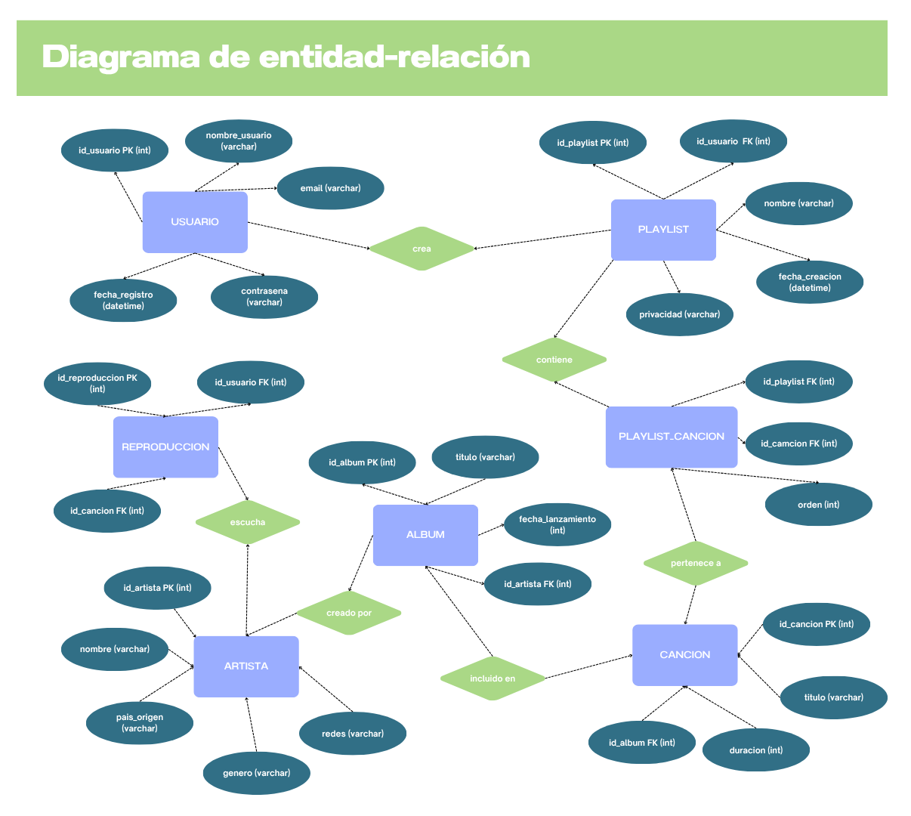

# TAREA2
- Convierte tu BD no estructurada de la tarea anterior en un modelo entidad-relación, representándolo con un diagrama entidad-relación. Usa nodos con figuras correctas y aristas claramente señaladas con los números correspondientes para las relaciones.
- Muestra el dominio de los atributos

**Base de datos de un reproductor de música online**
