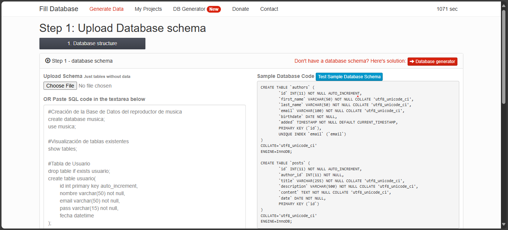

# TAREA5
- Agregar datos ficticios o de otras fuentes de manera automática (mediante funciones como las vistas en esta tarea)
- reportar en menos de 5 minutos hallazgos, dificultades, recomendaciones o recursos que sean relevantes

En este caso, aparte de los registros agregados manualmente tabla por tabla, se realizó el ejercicio de solicitar datos ficticios por medio de un generador de datos en línea: https://filldb.info/dummy

**Datos ficticios generados para la tabla "Artista"**

Una vez cargado el query de la BD, se solicitaron datos en específico para la tabla Artista, ya que era la que tenía menos registros al momento de realizar esta actividad. El sitio web pedía primeramente los tipos de datos y posteriormente generó los registros. Los cuales fueron exportados de la siguiente manera:

**Datos ficticios obtenidos del sitio web**
[Datos_ficticios](./artistaDatos.sql)

Aunque al final se optó por ignorar esos registros y regresar a escribir manualmente aquellos artistas que existen realmente. Aunque fue bueno para practicar generar datos para cuando una BD lo requiera. En este caso, retomaré mi control manual para asegurarme que se cuente con información real, puede ser más tardado pero funcional.

**Base de datos de un reproductor de música online**
[BD_MUSICA](/BD%20musica.sql)